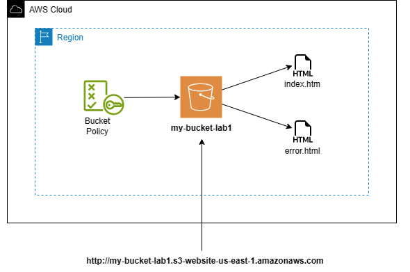

# **Creating a Static Website Using Amazon S3**
## **Introdcution**
In this hands-on AWS lab, we will learn how to create and configure a simple static website. We will also learn how to configure a custom error page for our website. This will demonstrate how to create a cost-effective website hosting solution for sites that consist of files such as HTML, CSS, JavaScript, fonts, and images.

## 1. **Create S3 Bucket and upload files**
* In the AWS Management Console, navigate to S3.
* Click Create bucket.
* Set the following values :

    * **Bucket name :** my-bucket- with the AWS account ID or another series of numbers at the end to make it globally unique.
    * **AWS Region :** US East (N. Virginia) us-east-1.

        

* In the Block Public Access settings for this bucket section, un-check Block all public access.

    

* Leave the rest of the settings as their defaults and create the bucket.

    

* Upload the error.html and index.html files provided in this repository.

    

## 2. **Enable Static Website Hosting**
* Enable static website hosting on an S3 bucket : Properties tab > Edit static website hosting

* On the Edit static website hosting page, set the following values:

    * **Static website hosting** : Select Enable.
    * **Hosting type** : Select Host a static website.
    * **Index document** : Select index.html.
    * **Error document** : Select error.html.

    

## 3. **Apply Bucket Policy**
 
    
    

